# User Roles

The User Roles Service is a core data service responsible for storing user roles for RBAC (
Role-Based Access Control), and integrating with AWS Cognito to provide a user administration API.

* [Documentation](#documentation)
* [Architecture](#architecture)
* [Endpoints](#endpoints)
  * [Roles API](#roles-api)
  * [Administration API](#administration-api)
* [Deploying User Roles service in your project](#deploying-user-roles-service-in-your-project)
* [Running locally](#running-locally)
* [Linting](#linting)

## Documentation

- [Main confluence page](https://liflig.atlassian.net/wiki/x/AQC3) (Liflig-internal)

## Architecture

The User Roles service has 2 modules:

- The `roles` module provides simple CRUD on user roles
- The `administration` module integrates with Cognito (the identity provider service from AWS), to
  allow clients to do CRUD on users and their associated roles

When verifying a user's JWT, only the roles module is used. An important design principle here is
that authentication should not be blocked when there are problems in the administration module.
Therefore, the User Roles service has been designed to make the roles module independent from the
administration module. For example, if the administration module is misconfigured, then the service
will still start, and only the administration API will respond with 500 Internal Server Error.



## Endpoints

### Roles API

| Endpoint                                              |              What               |
|-------------------------------------------------------|:-------------------------------:|
| GET /api/userroles/{username}                         |       Get roles for user        |
| PUT /api/userroles/{username}                         | Create or update roles for user |
| DELETE /api/userroles/{username}                      |      Delete roles for user      |
| GET /api/userroles?roleName={roleName}&orgId={orgId2} |      List/query user roles      |

#### Data structure of user role

```json
{
  "username": "user123",
  "roles": [
    {
      "applicationName": "application1",
      "orgId": "orgId1",
      "roleName": "orgOwner"
    },
    {
      "applicationName": "application2",
      "orgId": "orgId2",
      "roleName": "orgAdmin"
    },
    {
      "applicationName": "application2",
      "orgId": "orgId3",
      "roleName": "orgMember",
      "roleValue": "<value>"
    },
    {
      "roleName": "admin"
    }
  ]
}
```

### Administration API

When referring to “our identity provider” below, we mean AWS Cognito. But User Roles may be expanded
in the future to support other identity providers.

The user administration API does not take responsibility for verifying that a requesting user is
authorized to assign the given roles. That is the responsibility of the BFF (Backend-For-Frontend)
service in your project. This is because the User Roles service does not know the content or
hierarchy of roles in your project, so only a project-specific service has the knowledge to perform
authorization.

| Endpoint                                                                                                                                                                                                                                                                        | What                                                                                                                                                                                                                                                                                                       | Cognito API used                                                                                                                            |
|---------------------------------------------------------------------------------------------------------------------------------------------------------------------------------------------------------------------------------------------------------------------------------|------------------------------------------------------------------------------------------------------------------------------------------------------------------------------------------------------------------------------------------------------------------------------------------------------------|---------------------------------------------------------------------------------------------------------------------------------------------|
| GET /api/administration/users/{username}                                                                                                                                                                                                                                        | Get user data from our identity provider along with their roles                                                                                                                                                                                                                                            | [AdminGetUser](https://docs.aws.amazon.com/cognito-user-identity-pools/latest/APIReference/API_AdminGetUser.html)                           |
| POST /api/administration/users                                                                                                                                                                                                                                                  | Register user in our identity provider, along with roles                                                                                                                                                                                                                                                   | [AdminCreateUser](https://docs.aws.amazon.com/cognito-user-identity-pools/latest/APIReference/API_AdminCreateUser.html)                     |
| PUT /api/administration/users                                                                                                                                                                                                                                                   | Update existing user in our identity provider, along with their roles                                                                                                                                                                                                                                      | [AdminUpdateUserAttributes](https://docs.aws.amazon.com/cognito-user-identity-pools/latest/APIReference/API_AdminUpdateUserAttributes.html) |
| DELETE /api/administration/users/{username}                                                                                                                                                                                                                                     | Delete user in our identity provider, along with their roles                                                                                                                                                                                                                                               | [AdminDeleteUser](https://docs.aws.amazon.com/cognito-user-identity-pools/latest/APIReference/API_AdminDeleteUser.html)                     |
| POST /api/administration/users/{username}/reset-password                                                                                                                                                                                                                        | Reset a user's password                                                                                                                                                                                                                                                                                    | [AdminResetUserPassword](https://docs.aws.amazon.com/cognito-user-identity-pools/latest/APIReference/API_AdminResetUserPassword.html)       |
| GET /api/administration/users<br/>?limit={page size}<br/>&cursor={nextCursor from previous response}<br/>&searchString={searchString}<br/>&searchField={USERNAME \| EMAIL \| etc.}<br/>&orgId={role orgId}<br/>&applicationName={role applicationName}<br/>&roleName={roleName} | List/query users from our identity provider, along with their roles.<br/><br/>Uses cursor-based pagination: The response body includes a `nextCursor` field, which can be passed in the `cursor` query parameter to get the next page. When `nextCursor` is `null`, then there are no more users to fetch. | [ListUsers](https://docs.aws.amazon.com/cognito-user-identity-pools/latest/APIReference/API_ListUsers.html)                                 |             

#### Data structure of user data with roles

```json
{
  "username": "test.testesen",
  "userId": "4b670e7f-0ae9-4ce8-9a8b-b27d00d2f31d",
  "email": {
    "value": "test@example.org",
    "verified": true
  },
  "phoneNumber": {
    "value": "12345678",
    "verified": false
  },
  "userStatus": "CONFIRMED",
  "enabled": true,
  "createdAt": "2025-12-04T07:25:11Z",
  "attributes": {
    // Attributes are arbitrary key-value data submitted by your BFF.
    // Cognito supports certain standard attributes, such as "name".
    "name": "Test Testesen"
  },
  "roles": [
    {
      "applicationName": "test-application",
      "orgId": "liflig",
      "roleName": "admin",
      "roleValue": null
    }
  ]
}
```

## Deploying User Roles service in your project

- Set up a Cognito user pool
- Deploy User Roles service, using Docker image published on GitHub, along with a Postgres database
- For the user administration module to be enabled, the service needs the following:
  - Config parameter `aws.cognito.userPoolId`
  - These permissions:
    - `cognito-idp:AdminGetUser`
    - `cognito-idp:AdminCreateUser`
    - `cognito-idp:AdminUpdateUserAttributes`
    - `cognito-idp:AdminDeleteUser`
    - `cognito-idp:AdminResetUserPassword`
    - `cognito-idp:ListUsers`
- Implement a "pre-token generation lambda" that fetches roles from User Roles to populate Cognito
  JWTs
- Implement JWT verification and role parsing for authentication and authorization in your APIs
- For the user administration module:
  - Implement an API client in your BFF that calls the administration API of the User Roles service
    - Your BFF should verify that the requesting user has permission to update roles. This is where
      you enforce your project’s hierarchy of roles (i.e., which roles are allowed to change other
      roles)
  - Implement UI for user management

For example implementations of the points above, see the
[Liflig-internal Confluence page](https://liflig.atlassian.net/wiki/spaces/CALS/pages/16164029/User+Roles+Service#Deploying-User-Roles-service-in-your-project).

## Running locally

<!-- @formatter:off -->
1. Start the database: `docker-compose up -d`
2. Build and run the application
   - Option 1: Run the `Main.kt` file from your IDE
   - Option 2: Via Maven, `./build-and-run.sh`
   - Option 3: Package and run with the actual Docker image, `./build-and-run-docker.sh`
3. Access the service at http://localhost:8080/health
<!-- @formatter:on -->

## Linting

To only check linting (no tests etc):

```bash
mvn spotless:check
```

To format (does not fail on lint errors):

```bash
mvn spotless:apply
```
