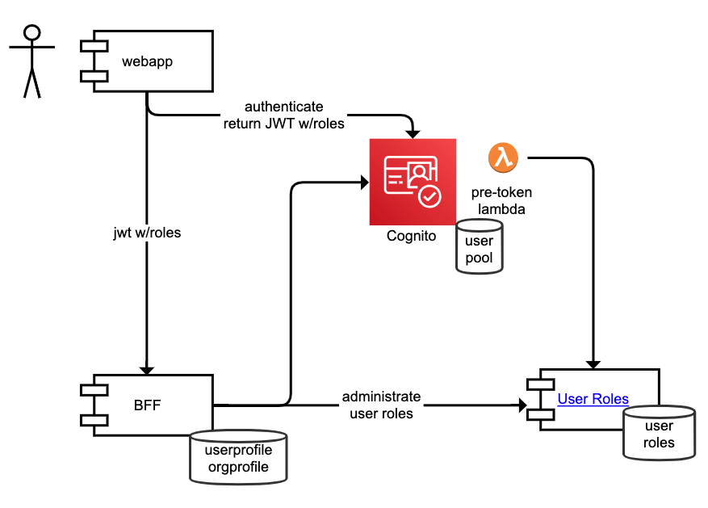

A generic service featuring RBAC (Role Based Access Control).

## Documentation

<!-- Optional links to other pages -->
More information is found here:

<!-- Add links that suits your project. These are just exammples: -->

- [Main confluence page](https://liflig.atlassian.net/wiki/x/AQC3)

# Example architecture

Can be used in conjunction with e.g. AWS Cognito and
a [pretoken generation trigger lambda](https://docs.aws.amazon.com/cognito/latest/developerguide/user-pool-lambda-pre-token-generation.html)
to add custom claims to an identity token.

_Note that this repo only contains the User Roles service_


# Endpoints

## CRUD endpoints

| Endpoint                     |                 What                 |
|------------------------------|:------------------------------------:|
| PUT /userroles/{username}    | create or update user roles for user |
| GET /userroles/{username}    |       get user roles for user        |
| DELETE /userroles/{username} |                                      |

**NB!** Currently no support for post, but can be implemented later.

## Data structure for PUT and GET

```
{
  "username": "user123",
  "roles": [
    {
      "applicationName": "application1",
      "orgId": "orgId1",
      "roleName": "orgOwner"
    },
    {
      "applicationName": "application2",
      "orgId": "orgId2",
      "roleName": "orgAdmin"
    },
    {
      "applicationName": "application2",
      "orgId": "orgId3",
      "roleName": "orgMember",
      "roleValue": "{"boards": [1,2,3]}"
    },
    {
      "roleName": "admin"
    }
  ]
}
```

## Query endpoints

| Endpoint                                          |                      What                      |
|---------------------------------------------------|:----------------------------------------------:|
| GET /userroles                                    |                 List all users                 |
| GET /userroles?orgId={orgId1}                     | List users with access to a given organization |
| GET /userroles?roleName=admin                     |          List users with a given role          |
| GET /userroles?roleName={roleName}&orgId={orgId2} |          List users with a given role          |

## Running locally

1. Start the database

   ```bash
   docker-compose up -d
   ```

1. Build and run the application

   All of these will skip tests to be quick.

1. Option 1: In IDE

   Run the `Main` file.

1. Option 2: Via Maven

   ```bash
   ./build-and-run.sh
   ```

1. Option 3: Package and run with the actual Docker image

   ```bash
   # See the script for details.
   ./build-and-run-docker.sh
   ```

1. Access the service at http://localhost:8080/health

## Linting

To only check linting (no tests etc):

```bash
mvn spotless:check
```

To format (does not fail on lint errors):

```bash
mvn spotless:apply
```
